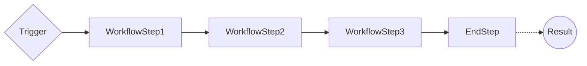
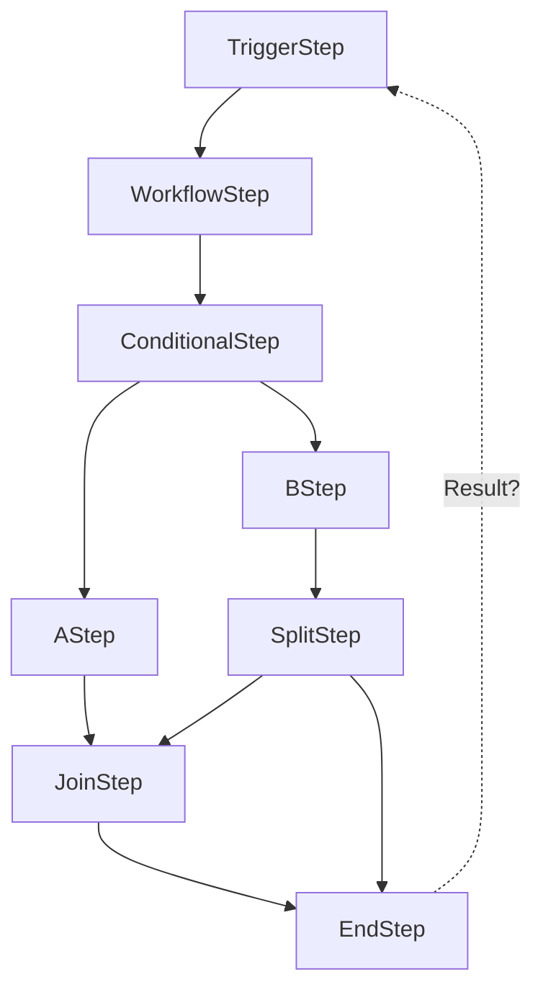

# Frank.WorkflowEngine
A simple workflow engine that is built on Dependency Injection and modern .net core features like Channel<>, IHostedService, 
and CronJobs.

## Concepts

### Workflow

A workflow is a collection of steps that are executed in a sequence. The workflow is responsible for managing the execution of the steps and the data that is passed between the steps.

### Binding

A binding is a way to connect the output of one step to the input of another step. The binding is responsible for passing 
the data between the steps and ensuring that the data is passed correctly. This is done by using Pub/Sub pattern and 
Channel<>, (ChannelWriter<>, ChannelReader<> as well), to pass the data between the steps.

### Trigger

A trigger can be a method call, a PulseFlow message, a CronJob, or any other event that starts a workflow. The trigger is responsible for starting the workflow and passing the initial data to the first step in the workflow.

### Step

A workflow step is a single unit of work that is executed as part of a workflow. The step is responsible for performing the work and passing the data to the next step in the workflow.

### WorkflowEnd

An end step is a special type of step that is used to end a workflow. The end step is responsible for finalizing the 
workflow and passing the data to the caller. And it should update some status of the workflow in some dependency.

### WorkflowContext

The workflow context is a container that holds the metadata about the workflow. It uses Dependency Injection with keyed 
services based on workflow id to store the data. The context is NOT responsible for managing the data that is passed between 
the steps in the workflow, only the metadata about the workflow and its state and execution.

## Idea Sketches

### Basic Workflow

### Complex Workflow

